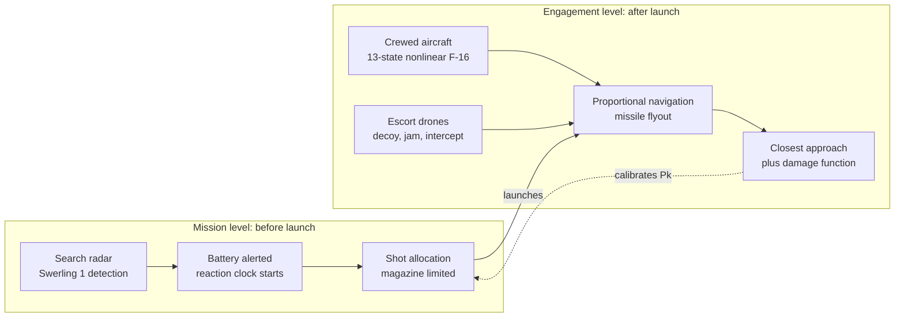
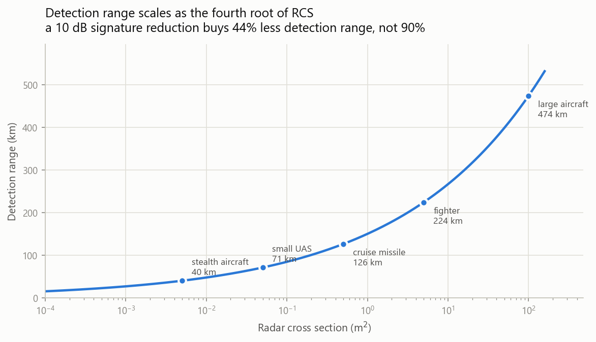

<h1 align="center">Escort Drone Employment Study</h1>

<p align="center">
  <em>Do escort drones protect the crewed aircraft they fly with — or just tell the defender where to look?</em>
</p>

<p align="center">
  <a href="https://github.com/LukasCode1/AeroBenchVVPython-Fury-Drone-Simulator/actions/workflows/tests.yml"></a>
  
  
  
</p>

<p align="center">
  
</p>

<p align="center">
  <sub>One engagement. The escort flies onto the missile's collision triangle, forces the<br>
  warhead to be expended 4 km short of the crewed aircraft, and is destroyed doing it.</sub>
</p>

---

## The question

Collaborative Combat Aircraft — autonomous drones flown alongside crewed fighters — are usually
argued for on the grounds that they soak up missiles. Wargames run at the Mitchell Institute
found exactly that: used in numbers, they forced the defender to expend missiles and imposed
cost.

A separate account, from a Naval War College wargame relayed publicly by Hudson Institute's
Bryan Clark on the *ChinaTalk* podcast, reached a much less comfortable conclusion. Paraphrasing
the concern:

> Current and planned drone designs are **more detectable** than the stealth aircraft they escort.
> They are not only easier to destroy — they **attract attention to the area**, putting the crewed
> aircraft in danger. The use case for flying them close to crewed aircraft is narrow.

Both accounts are from credible analysts. Both describe real effects. They point in opposite
directions, and **the sign of the net effect has not been worked out in the open.**

This repository works it out.

---

## The answer

**It depends on how many missiles the defender has — and almost nothing else.**

<p align="center">
  
</p>

| Defender magazine | Unescorted survival | Effect of adding one escort |
|---|---|---|
| **1 missile** | 0.47 | **helps** — up to **+53 points** above 0.035 m² |
| **2 missiles** | 0.38 | **hurts** at every tested signature — worst **−27** |
| **4 missiles** | 0.42 | **hurts** — worst **−42** |
| **8 missiles** | 0.43 | **hurts** — worst **−43** |

The crossover sits **between one and two missiles** — between a defender with fewer
missiles than the formation has aircraft, and a defender with enough. Below that line the
escort absorbs the shot and the crewed aircraft walks away. Above it, alerting the defender
early costs more than the drone ever absorbs.

Three findings fall out of the sweep:

**The escort's own signature is not the lever.** Across four orders of magnitude of radar cross
section, the curves are nearly flat once the escort is visible at all. What moves the answer is
the defender's magazine.

**A very stealthy escort is neither help nor harm.** Below roughly 0.002 m² it is not seen early
enough to start the defender's clock, and not seen early enough to draw a missile either.
Statistically indistinguishable from flying alone.

**The worst thing you can build is an escort that looks like the aircraft it escorts.** Around
0.005–0.01 m² — signature-matched to the crewed aircraft — *every* magazine depth shows a loss.
Visible enough to alert the defender, not attractive enough to pull the shot. That is
uncomfortable, because signature-matching is an obvious thing to aim for.

> **The load-bearing assumption.** The harm mechanism is that the battery's reaction clock starts
> at its first detection of *anything*. A defender that reacted to each contact independently
> would show the absorption benefit without the alerting cost, and this result would move. It is
> stated next to the finding rather than buried — if this work is wrong, that is where it is wrong.

---

## Why the numbers are trustworthy

The first version of this study reported that escort drones raised survival from **0.82 to 0.93**.
That result was noise sitting on top of a broken model, and finding out why is most of the
engineering in this repository.

Hit or miss was decided by sampling range once per integration step. At 900 m/s closing against a
230 m/s target, one 0.05 s step advances the geometry about **56 m** — so a 15 m lethal radius was
roughly a quarter of a single step. Whether anything died came down to where the sampling grid
happened to land.

A sweep of launch geometry made it unambiguous: the kill/no-kill outcome flipped on **half a degree**
of launch angle, and a 2.5°-spaced sweep recorded **0 kills in 21 shots** against a non-manoeuvring
target with a perfectly guided missile.

The fix is to stop sampling range and start solving for it. Over one step, relative motion is
linear, so |**r**₀ + **v**t|² is a quadratic in t whose minimum is exact no matter how coarse the
step. An unclamped minimum inside the step is a fly-by — which is what a proximity fuze actually
triggers on.

| | Before | After |
|---|---|---|
| Unopposed miss distance | 16–55 m (target always lived) | **< 1 m** |
| Unopposed kill rate | ~30%, set by sampling phase | **0.892** vs 0.900 expected |
| Interceptor closest approach | 959 m | **9.5 m** |
| Drone attrition | structurally zero, all 420 trials | **0.63–0.82** per engagement |
| Trials needed to resolve the effect | 177 per arm (had 60) | **4 per arm** |

Three more defects of the same family turned up alongside it — countermeasures expressed as
per-tick probabilities (halve the timestep, halve the effect), acceleration clipped per axis
(allowing √3 × the stated g-limit on a diagonal), and closing velocity computed as the scalar sum
of two speeds regardless of geometry. All four were the same mistake: **behaviour that depended on
the integration step rather than on physics.**

Every one is now pinned by a regression test. The full evidence — including the textbook checks
the model is validated against — is in **[`fury_sim/VALIDATION.md`](fury_sim/VALIDATION.md)**.

```
$ python -m pytest fury_sim/tests/ -q
...............................                                    [100%]
31 passed in 27s
```

---

## How it works

Two model resolutions, coupled at exactly one number.



The crewed aircraft is flown with **AeroBenchVV's actual nonlinear F-16 model** — 13 states,
integrated with `scipy.integrate.RK45`, driven by its own waypoint autopilot. The trajectory this
study rests on is not a simplified stand-in.

Detection uses the radar range equation's dependence on target size and range, so detection range
scales as the **fourth root** of radar cross section. That is why low observability is expensive:

<p align="center">
  
</p>

Single-scan detection probability is the closed-form **Swerling Case 1** result,
`Pd = Pfa^(1/(1+SNR))` — exact for a slowly fluctuating target, which is the standard model for an
aircraft, rather than a curve fitted to one.

The two levels meet at one value: the mission-level single-shot kill probability is **0.87**, which
is what the engagement-level model *measures* against an undefended, non-manoeuvring aircraft. The
detailed model calibrates the coarse one.

---

## What happens once the missile is already flying

The second study asks the narrower question: given a missile in the air, does an escort swarm save
the aircraft, and what does it cost?

<p align="center">
  
</p>

| Escort drones | Survival | 95% CI | Drones lost |
|---|---|---|---|
| 0 | 0.13 | [0.07, 0.24] | 0.00 |
| 1 | 1.00 | [0.94, 1.00] | 0.67 |
| 2 | 1.00 | [0.94, 1.00] | 0.65 |
| 4 | 1.00 | [0.94, 1.00] | 0.78 |
| 8 | 1.00 | [0.94, 1.00] | 0.77 |

**One interceptor is sufficient; more add nothing.** Survival goes to 1.00 with a single escort and
stays there. The marginal value of the second through eighth drone is zero against this threat.

**Protection is paid for in drones.** The interceptor forces the warhead to be expended and is
inside the burst when it happens. The exchange is one drone, most of the time, for one crewed
aircraft.

**Soft kill did almost nothing.** Jammers and decoys denied seeker lock on under 2% of ticks and
rarely changed an outcome — because against a target holding a constant course, a missile that
loses lock coasts along a heading that is *already* a collision course. Electronic attack without a
defensive manoeuvre is close to worthless.

<p align="center">
  
</p>

> **What the 1.00 is not.** The interceptor is perfectly cued, with no detection or vectoring delay
> modelled. Add realistic cueing latency and its achievable closest approach grows past the 30 m
> fuze radius. Read this as *body-block is geometrically feasible here*, not *body-block is
> reliable*.

---

## Running it

```bash
pip install -r requirements.txt

cd fury_sim
python -m pytest tests/ -q      # 34 verification and regression tests, ~30 s
python run_rcs_sweep.py         # the crossover study, ~1 min
python run_experiment.py        # the swarm study, ~1 min
python animate_engagement.py    # renders one engagement as a 3D GIF
```

Python 3.11 or newer. No install step is needed for the F-16 model —
`f16_mothership.py` puts `code/` on `sys.path` at import time.

CI runs the test suite on 3.11, 3.12 and 3.13, and separately regenerates **both studies from a
clean checkout** and publishes the results as a build artifact — so every figure and table above is
checkable rather than taken on trust.

Every trial draws from its own independent random stream addressed by `[MASTER_SEED, ...]`, so
sweeps reproduce exactly, any single trial can be re-derived in isolation for debugging, and adding
a configuration does not perturb the ones already run.

Full study plan — purpose, scope, assumptions, measures of effectiveness, method, results and
limitations — is in **[`fury_sim/README.md`](fury_sim/README.md)**.

---

## What this does not model

Stated plainly, because a result is only as good as its scope:

- **The crewed aircraft never defends.** No break turn, no terrain masking. Survival numbers are a
  lower bound, and it is why soft kill measures as worthless here.
- **One radar, one battery, one axis of attack.** Multi-axis ingress, netted sensors and overlapping
  batteries would all change the cueing story.
- **Detection is radar-only.** No IRST, no passive RF, no datalink emissions — all real ways a
  formation gives itself away.
- **No cost model.** This counts missiles, not dollars. Whether trading a drone for a missile is a
  good deal depends on their relative price.
- **Miss distance has no spread.** With perfect seeker information and a non-manoeuvring target, the
  guidance law produces a near-zero miss every time, so the damage function is correct but barely
  exercised.
- **Nothing here represents a real system.** The guidance law, radar range equation and detection
  statistics are published textbook material. Every signature, warhead and countermeasure parameter
  is notional and drawn from open published ranges.

---

## Credits

The flight dynamics are **AeroBenchVV**, the F-16 verification benchmark that makes up the `code/`
directory — the work of Stanley Bak and collaborators, ported to Python from the original MATLAB
benchmark. Its core aerodynamics are used unmodified; only a thin wrapper
(`fury_sim/f16_mothership.py`) was added to drive it from this simulation.

> "Verification Challenges in F-16 Ground Collision Avoidance and Other Automated Maneuvers",
> P. Heidlauf, A. Collins, M. Bolender, S. Bak, 5th International Workshop on Applied Verification
> for Continuous and Hybrid Systems (ARCH 2018)

- Original MATLAB benchmark: https://github.com/pheidlauf/AeroBenchVV
- Original Python port: https://github.com/stanleybak/AeroBenchVVPython

Guidance law and miss-distance treatment follow Zarchan, *Tactical and Strategic Missile Guidance*.
The wargame accounts that motivate the study question are public:
[Hudson Institute / ChinaTalk](https://www.hudson.org/defense-strategy/out-ammo-real-are-ccas-dumb-bryan-clark),
[Mitchell Institute](https://www.mitchellaerospacepower.org/app/uploads/2024/01/CCA-Wargame-Rollout-Briefing-FINAL.pdf),
[CSIS](https://www.csis.org/analysis/department-defenses-collaborative-combat-aircraft-program-good-news-bad-news-and).

<details>
<summary><b>About the underlying AeroBenchVV benchmark</b></summary>

<p align="center"></p>

This is the v2 branch of the AeroBenchVV benchmark, a python3 project with modularity and general
simulation capabilities beyond the original paper version (see the v1 branch for that). It contains
a python version of models and controllers that test automated aircraft maneuvers by performing
simulations. The hope is to provide a benchmark to motivate better verification and analysis
methods, working beyond models based on Dubins car dynamics, towards the sorts of models used in
aerospace engineering. Roughly speaking, the dynamics are nonlinear, have about 10-20 dimensions
(continuous state variables), and hybrid in the sense of discontinuous ODEs, but not with jumps in
the state.

**Required libraries:** `numpy` (matrix operations), `scipy` (simulation, RK45 integration, trim
condition optimization), `matplotlib` (animation and plotting; requires `ffmpeg` for `.mp4` output,
`.gif` output uses matplotlib's built-in Pillow writer). `slycot` and `control` are needed only for
control design, not for simulation.

**Animation issues:** use matplotlib 3.1.1 if you get errors like
`"art3d.py", line 175, in set_3d_properties / AttributeError: 'list' object has no attribute 'shape'`.

**Release documentation:** Distribution A: Approved for Public Release (88ABW-2020-2188) (changes in
this version). Distribution A: Approved for Public Release (88ABW-2017-6379) (v1).

</details>
