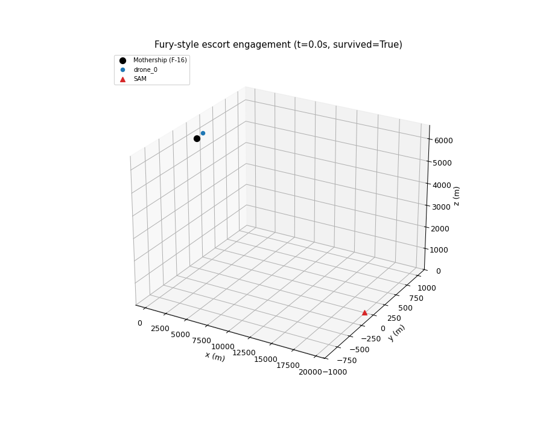
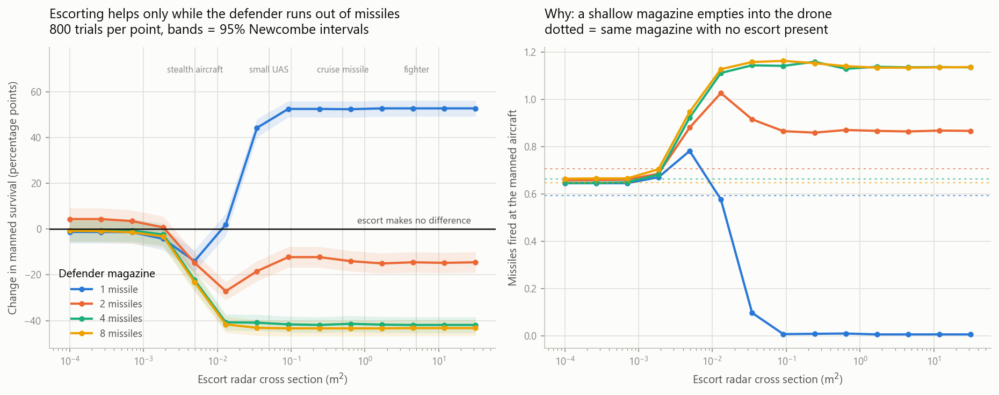
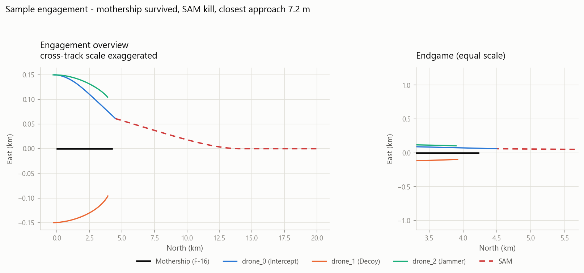
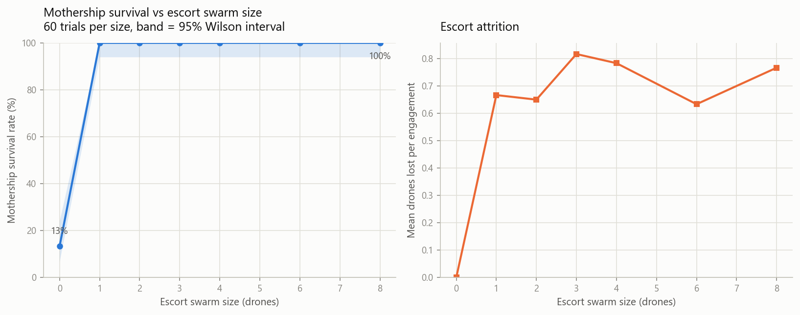

# Fury Style Escort Swarm Engagement Simulation

A simulation testbed for studying whether an autonomous escort drone swarm
improves the survivability of a manned strike aircraft against a single
surface to air missile shot, and how that effect scales with swarm size and
role allocation. The manned aircraft (the "mothership") is flown with the
same nonlinear F 16 flight dynamics model used for the verification
benchmark this project is built on, so the ingress trajectory this study
relies on is not a simplified stand in.



Black marker and trail: the mothership. Colored markers: escort drones. Red
triangle: the inbound SAM. In the clip above the escort drone flies onto the
missile's collision triangle and forces the warhead to be expended 4 km short
of the mothership — and is destroyed by the burst doing it. The mothership
survives. That trade, one drone for one manned aircraft, is the result this
study exists to quantify.

The text overlay in the final frames states the outcome explicitly, since at
this simulation's scale an intercept and a hit on the mothership otherwise
look nearly identical; whatever was actually destroyed is marked with a red X.

## Research question

Given a fixed missile threat and a fixed ingress profile, does adding escort
drones in defined roles (decoy, jammer, hard kill interceptor) change the
probability that the mothership survives, and is there a point of
diminishing or negative returns as swarm size grows?

## Model summary

| Entity          | Dynamics model                                                   | Fidelity |
|------------------|-------------------------------------------------------------------|----------|
| Mothership       | Full 13 state nonlinear F 16 model (this repository's AeroBenchVV benchmark), LQR inner loop, waypoint outer loop autopilot | Nonlinear ODE, integrated with `scipy.integrate.RK45` |
| Escort drones    | Energy state / bank to turn point mass model | Reduced order, closed form update |
| SAM              | Proportional navigation guidance (Zarchan, *Tactical and Strategic Missile Guidance*), generic seeker with field of view, range, and lock/jam probability | Reduced order, textbook guidance law |

The mothership deliberately gets the higher fidelity treatment: this study
is about the survivability of that one aircraft, so its trajectory comes
from the same validated nonlinear model used for the verification work
described below, rather than a simplified approximation. None of these
models represent the seeker, airframe, or guidance parameters of any
specific real world system.

## Results

From a 60 trial per swarm size Monte Carlo sweep, SAM launched at 20 km,
offset uniformly between -25 and +25 degrees off nose on. Every trial draws
from its own reproducible random stream, so this table regenerates exactly.

| Escort drones | Survival rate | 95% CI | Mean drones lost |
|---------------|---------------|--------------|------------------|
| 0             | 0.13          | [0.07, 0.24] | 0.00 |
| 1             | 1.00          | [0.94, 1.00] | 0.67 |
| 2             | 1.00          | [0.94, 1.00] | 0.65 |
| 3             | 1.00          | [0.94, 1.00] | 0.82 |
| 4             | 1.00          | [0.94, 1.00] | 0.78 |
| 6             | 1.00          | [0.94, 1.00] | 0.63 |
| 8             | 1.00          | [0.94, 1.00] | 0.77 |

Three findings, stated with the assumptions that bound them:

- **Unescorted, the aircraft dies.** A perfectly guided missile against a
  non-manoeuvring F-16 achieves essentially zero miss distance; 13% survival
  is exactly the complement of the modeled warhead lethality.
- **One interceptor is sufficient and more add nothing.** Survival goes to
  1.00 with a single escort and stays there — the marginal value of the
  second through eighth drone is zero under this threat. This is an upper
  bound: the interceptor is perfectly cued, with no detection or tracking
  delay modeled.
- **Protection is paid for in drones.** Mean attrition is 0.63-0.82 drones per
  engagement. The interceptor forces the warhead to be expended and is inside
  the burst when it happens.

Hit/miss is resolved by solving for closest approach within each integration
step rather than by sampling range at step boundaries. That distinction
decides every number above; the evidence, including the defect it replaced,
is in [`fury_sim/VALIDATION.md`](fury_sim/VALIDATION.md).

## Does the escort give the formation away?

The table above only covers what happens once a missile is already in the air.
The more common objection to manned-unmanned teaming is upstream of that: a
drone with a larger radar cross section is seen further out, and seeing it
tells the defender where to look. A second, mission-level study sweeps escort
RCS against defender magazine depth.



| Defender magazine | Unescorted survival | Effect of adding an escort |
|---|---|---|
| 1 missile | 0.47 | **helps**, up to +53 points, above 0.035 m² |
| 2 missiles | 0.38 | **hurts** at every tested RCS, worst −27 points |
| 4 missiles | 0.42 | **hurts**, worst −42 points |
| 8 missiles | 0.43 | **hurts**, worst −43 points |

The sign is set by the defender's magazine, not by the escort. With one
missile available it goes to the drone and the manned aircraft walks. With two
or more, alerting the defender early costs more than the drone absorbs. The
worst design point is an escort with roughly the same signature as the
aircraft it escorts — visible enough to start the defender's clock, not
attractive enough to draw the shot.

Detection range scales as the fourth root of RCS, so this is not a small
effect to engineer around: a 10 dB signature reduction buys 44% less detection
range, not 90%.




## Running it

```
cd fury_sim
python -m pytest tests/ -q       # 18 verification/regression tests
python run_experiment.py         # Monte Carlo sweep across swarm sizes
python animate_engagement.py     # renders one engagement as a 3D GIF
```

These depend only on `numpy`, `scipy`, `matplotlib`, `pandas`, `pytest` and
`Pillow`. No separate install step is needed for the underlying F 16 model:
the mothership wrapper adds `code/` to `sys.path` at import time.

Full documentation, including the file layout, animation options, how to
read the outcome labels, and known modeling limitations, is in
[`fury_sim/README.md`](fury_sim/README.md).

## Credits

This project is a swarm engagement study built on top of **AeroBenchVV**,
the F 16 verification benchmark that makes up the rest of this repository
(the `code/` directory). All flight dynamics used here, including the
mothership's full nonlinear model, come from that benchmark unmodified in
its core aerodynamics; only a thin wrapper (`fury_sim/f16_mothership.py`)
was added to drive it from this simulation.

AeroBenchVV is the work of Stanley Bak and collaborators, ported to Python
from the original MATLAB benchmark. For citation purposes, please use:

> "Verification Challenges in F-16 Ground Collision Avoidance and Other
> Automated Maneuvers", P. Heidlauf, A. Collins, M. Bolender, S. Bak, 5th
> International Workshop on Applied Verification for Continuous and Hybrid
> Systems (ARCH 2018)

Original MATLAB benchmark: https://github.com/pheidlauf/AeroBenchVV
Original Python port: https://github.com/stanleybak/AeroBenchVVPython

---

## AeroBenchVV benchmark (underlying project)

<p align="center">  </p>

This is the v2 branch of the AeroBenchVV benchmark, a python3 project with
modularity and general simulation capabilities beyond the original paper
version (see the v1 branch for that). It contains a python version of
models and controllers that test automated aircraft maneuvers by performing
simulations. The hope is to provide a benchmark to motivate better
verification and analysis methods, working beyond models based on Dubins
car dynamics, towards the sorts of models used in aerospace engineering.
Roughly speaking, the dynamics are nonlinear, have about 10-20 dimensions
(continuous state variables), and hybrid in the sense of discontinuous
ODEs, but not with jumps in the state.

### Required libraries

The following Python libraries are required (can be installed using `pip
install <library>`):

`numpy`, for matrix operations.

`scipy`, for simulation and numerical integration (RK45) and trim condition
optimization.

`matplotlib`, for animation and plotting (requires `ffmpeg` for `.mp4`
output; `.gif` output uses matplotlib's built in Pillow writer).

`slycot`, for control design (not needed for simulation).

`control`, for control design (not needed for simulation).

### Animation issues

Use matplotlib version 3.1.1 if you get errors like:

```
"art3d.py", line 175, in set_3d_properties
    zs = np.broadcast_to(zs, xs.shape)
AttributeError: 'list' object has no attribute 'shape'
```

### Release documentation

Distribution A: Approved for Public Release (88ABW-2020-2188) (changes in this version)

Distribution A: Approved for Public Release (88ABW-2017-6379) (v1)
