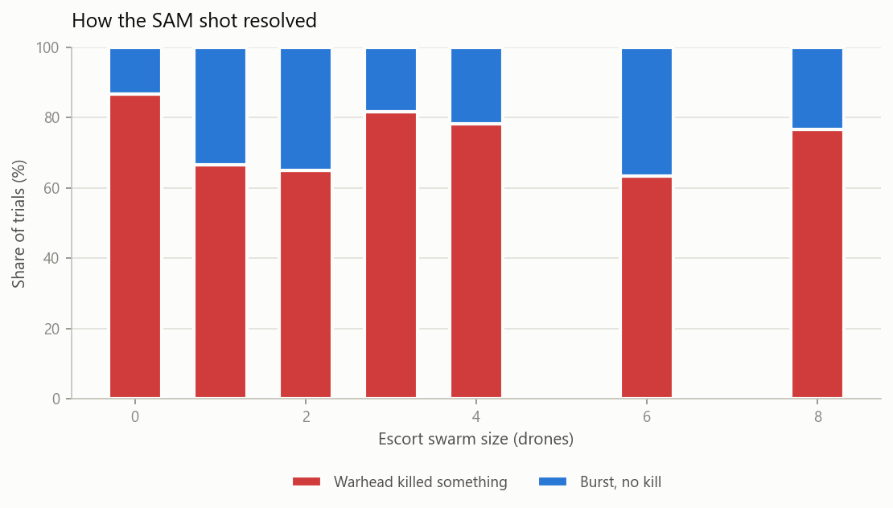

# Escort drone employment study

Two questions about putting autonomous escort drones alongside a manned strike
aircraft, asked at the two resolutions they actually live at:

- **Once you are being shot at**, does an escort swarm improve the manned
  aircraft's chance of surviving the missile, and what does that cost in drones?
- **Before anyone shoots**, does the escort make the manned aircraft *easier to
  find* — and if so, when does that outweigh the protection it provides?

The second question is the one most often raised against manned-unmanned
teaming, and it is the one an engagement-level model structurally cannot answer.

The manned aircraft is flown with AeroBenchVV's actual nonlinear F-16 flight
dynamics model, so the ingress trajectory is the same six-degree-of-freedom
aircraft model used elsewhere in this repository, not a simplified stand-in.

Structured as a study plan: purpose, scope, assumptions, measures of
effectiveness, method, results, limitations.

---

## 1. Purpose of study

**Study A (engagement level).** Quantify the change in manned survival
probability produced by adding escort drones in defined roles (decoy, jammer,
hard-kill interceptor) against a fixed missile threat and a fixed ingress
profile, and find the point of diminishing returns as swarm size grows.

**Study B (mission level).** Determine whether an escort's radar cross section
makes the manned aircraft more or less likely to complete its ingress, and
identify the conditions under which the sign of that contribution flips.

## 2. Scope and limitations

**In scope:** one manned aircraft, one threat system, 0-8 escort drones, a
single ingress geometry, engagement-level missile physics and mission-level
detection and shot allocation.

**Out of scope, and therefore not claimed:** multi-axis attacks, adversary
decision-making beyond a fixed engagement rule, basing and sortie generation,
operator workload, and cost. Study B counts missiles, not dollars; a
cost-exchange result needs a cost model this study does not have.

No model here represents the seeker, airframe, warhead, radar, or guidance
parameters of any real system. The guidance law, radar range equation and
detection statistics are published textbook material; every RCS, warhead and
countermeasure parameter is notional and drawn from open published ranges.

## 3. Critical assumptions

| # | Assumption | Why it matters |
|---|---|---|
| A1 | The manned aircraft flies straight and level and never defends | Removes the single most effective real countermeasure. Study A survival is a lower bound. |
| A2 | Drones have perfect knowledge of missile position and velocity | No detection, tracking or cueing latency, so intercept performance is an upper bound. |
| A3 | One SAM per engagement in Study A | No saturation, no re-attack. Magazine depth is a swept parameter in Study B instead. |
| A4 | Missile flies at constant speed, no drag or motor burn | Bounded only by a hard flight-time limit. |
| A5 | Countermeasure effectiveness is a hazard rate, not a modelled waveform | Rates are placeholders, not measurements. |
| A6 | The defender is alerted by its first detection of anything | This is the mechanism by which an escort can hurt. If real batteries do not work this way, Study B's harm result weakens. |
| A7 | Aircraft are Swerling Case 1 (slowly fluctuating) targets | Standard for aircraft, but a choice; Swerling 0 or 3 would shift absolute detection ranges. |

A1, A2 and A6 are the ones that most affect the headline results. Each is
restated next to the finding it bounds.

## 4. Measures of effectiveness

| MOE | Definition |
|---|---|
| Manned survival rate | Fraction of trials the manned aircraft is not destroyed, with a 95% Wilson interval |
| Change in survival | Escorted minus unescorted survival, with a 95% Newcombe interval for the difference |
| Escort attrition | Mean drones lost per engagement |
| Missiles fired at the manned aircraft | The mechanism behind Study B's result |
| Miss distance | Closest point of approach between missile and whatever it bursts against |
| Shot resolution | Whether the SAM killed, burst without killing, or ran out of energy |

## 5. Method

Two model resolutions, tied together at one point.

**Engagement level** — what happens after launch.

| Entity | Dynamics model | Fidelity |
|---|---|---|
| Manned aircraft | AeroBenchVV 13-state nonlinear F-16, LQR inner loop, waypoint outer loop | Full nonlinear ODE, `scipy.integrate.RK45` |
| Escort drones | Energy-state / bank-to-turn point mass | Reduced order, closed-form update |
| SAM | Proportional navigation (Zarchan), generic seeker, proximity fuze, Gaussian damage function | Reduced order, textbook guidance law |

Hit/miss is resolved by solving for closest approach **inside** each integration
step, not by sampling range at step boundaries. That distinction decides every
number in Study A — see [`VALIDATION.md`](VALIDATION.md) §1.

**Mission level** — what happens before launch. Detection probability per scan
uses the closed-form Swerling Case 1 result, `Pd = Pfa^(1/(1+SNR))`, with SNR
following the radar range equation's dependence on target size and range, so
detection range scales as the fourth root of RCS. A magazine-limited battery
engages what the radar holds, after a cold-start reaction delay that begins at
its first detection of *anything*.

The two levels meet at one number: the mission-level single-shot kill
probability defaults to 0.87, which is what the engagement-level model measures
against an undefended, non-manoeuvring aircraft. That is the only place the
resolutions are coupled, and it is deliberate — the detailed model calibrates
the coarse one.

**Sampling.** Study A: 60 trials per swarm size, SAM launched from 20 km at an
offset drawn uniformly from ±25° off nose-on. Study B: 800 trials per point over
a 14-point log RCS grid and four magazine depths. Every trial draws from its own
independent stream addressed by `[MASTER_SEED, ...]`, so sweeps reproduce
exactly, individual trials reproduce in isolation, and adding a configuration
does not perturb existing ones.

## 6. Study A results — escort swarm against a missile in flight

| Escort drones | Survival rate | 95% CI | Mean drones lost | Mean miss distance |
|---|---|---|---|---|
| 0 | 0.13 | [0.07, 0.24] | 0.00 | 0.00 m |
| 1 | 1.00 | [0.94, 1.00] | 0.67 | 6.29 m |
| 2 | 1.00 | [0.94, 1.00] | 0.65 | 6.35 m |
| 3 | 1.00 | [0.94, 1.00] | 0.82 | 6.60 m |
| 4 | 1.00 | [0.94, 1.00] | 0.78 | 6.59 m |
| 6 | 1.00 | [0.94, 1.00] | 0.63 | 6.80 m |
| 8 | 1.00 | [0.94, 1.00] | 0.77 | 6.63 m |





**A1 — Unescorted, the aircraft dies.** A perfectly guided PN missile against a
non-manoeuvring F-16 achieves essentially zero miss distance, and 13% survival
is exactly the complement of the modelled warhead lethality (Pk_max = 0.9).

**A2 — One interceptor is sufficient; more add nothing.** Survival goes to 1.00
with a single escort and stays there. The effect is large enough to resolve with
four trials per arm; the other six configurations are indistinguishable from
each other. The marginal value of the second through eighth drone is zero.

**A3 — Protection is paid for in drones.** Mean attrition is 0.63-0.82 drones
per engagement. The interceptor forces the warhead to be expended and is inside
the burst when it happens. The exchange is one drone, most of the time, for one
manned aircraft.

**A4 — Soft kill did almost nothing.** Jammers and decoys denied lock on under
2% of ticks and rarely changed an outcome. Assumption A1 is why: against a
target holding a constant course, a missile that loses lock coasts along a
heading that is already a collision course. Electronic attack without a
defensive manoeuvre is close to worthless.

*What A2 is not:* 1.00 is an upper bound produced by A2 — the interceptor is
perfectly cued. Add realistic detection and vectoring delay and its achievable
closest approach grows past the 30 m fuze radius. Read A2 as *body-block is
geometrically feasible here*, not *body-block is reliable*.

One engagement, rendered by `animate_engagement.py`. The escort flies onto the
missile's collision triangle, forces the warhead to be expended 4 km short of
the manned aircraft, and is destroyed by the burst. The aircraft survives.


## 7. Study B results — does the escort give the formation away?


| Defender magazine | Unescorted survival | Effect of adding an escort |
|---|---|---|
| 1 missile | 0.47 | **helps**, up to +53 points, for RCS above 0.035 m² |
| 2 missiles | 0.38 | **hurts** at every tested RCS, worst −27 points |
| 4 missiles | 0.42 | **hurts**, worst −42 points |
| 8 missiles | 0.43 | **hurts**, worst −43 points |

**B1 — The sign of the escort's contribution is set by magazine depth, not by
the escort.** With a single interceptor missile available, a visible escort is
worth +53 points of survival: the one missile goes to the drone. With two or
more, the escort is a net liability at every radar cross section tested. The
crossover sits between one and two missiles — that is, between a defender with
fewer missiles than there are aircraft in the formation, and one with enough.

**B2 — A stealthy escort is neither help nor harm.** Below about 0.002 m² the
escort is not detected early enough to start the defender's clock, and also not
detected early enough to draw a missile. Its contribution is statistically
indistinguishable from flying alone.

**B3 — The worst case is an escort about as visible as the aircraft it
escorts.** Around 0.005-0.01 m², every magazine depth shows a loss. The escort
is visible enough to alert the defender but not preferentially attractive
enough to draw fire away from the manned aircraft. Matching the escort's
signature to the manned aircraft's is the one design point to avoid.

**B4 — The mechanism is missile accounting, not detection.** The right-hand
panel shows why: only in the single-missile case does the escort measurably
reduce the number of missiles fired at the manned aircraft. In every deeper
magazine the escort *raises* it, because alerting the battery early gives it
more time to shoot at everything.

*What B1 is not:* this rests on A6, the assumption that the defender's reaction
clock starts at its first detection of anything. That is the entire harm
mechanism. A defender that reacts to each contact independently would show the
absorption benefit without the alerting cost, and the result would move.

## 8. Repository layout

| File | Role |
|---|---|
| `lethality.py` | Closest-approach solver, damage function, hazard-rate conversion |
| `detection.py` | Radar range equation, Swerling 1 detection, magazine-limited battery, ingress model |
| `mcstats.py` | Wilson and Newcombe intervals, required-sample-size |
| `f16_mothership.py` | Wraps `code/aerobench` as the manned aircraft; metres/feet conversion at the boundary |
| `aircraft.py` | Reduced-order `Vehicle` model and autopilot, used for escort drones |
| `swarm.py` | `Drone` and swarm role logic: escort, decoy, jammer, interceptor. Role policy is pluggable |
| `missile.py` | `GenericSAM`: PN guidance, seeker acquisition, proximity fuze, damage roll |
| `engagement.py` | `run_engagement()`: one aircraft, one swarm, one SAM, one outcome |
| `run_experiment.py` | Study A harness and figures |
| `run_rcs_sweep.py` | Study B harness and the crossover figure |
| `animate_engagement.py` | Renders one engagement as an animated 3D GIF |
| `viz_style.py` | Shared chart palette and chrome |
| `tests/` | 31 unit and end-to-end regression tests |
| `VALIDATION.md` | Verification and validation evidence |

## 9. Running it

```
cd fury_sim
python -m pytest tests/ -q      # 31 tests, ~27 s
python run_experiment.py        # Study A sweep, ~1 min
python run_rcs_sweep.py         # Study B sweep, ~1 min
python animate_engagement.py    # renders one engagement as a 3D GIF
```

Requires `numpy`, `scipy`, `matplotlib`, `pandas`, `pytest` and `Pillow`. No
separate install step for the AeroBenchVV dependency: `f16_mothership.py` adds
`code/` to `sys.path` at import time.

### Animation options

| Flag | Meaning | Default |
|---|---|---|
| `--n-drones` | escort swarm size | 1 |
| `--seed` | trial seed | 1 |
| `--sam-offset-deg` | SAM launch angle off nose-on | 0 |
| `--max-frames` | rendered frame budget | 200 |
| `--hold-seconds` | final-frame freeze before the loop restarts | 2.5 |
| `--elev`, `--azim` | 3D camera angle | 25, -60 |
| `--fps` | playback frame rate | 20 |

At this simulation's scale an intercepted SAM and a hit on the manned aircraft
look nearly identical — both end with the SAM marker converging on the same
cluster. The animation states the outcome in text rather than leaving it to
marker proximity, and marks whatever was actually destroyed with a red X.

## 10. Known limitations

Beyond the assumptions in §3:

- **Miss distance has no spread.** With perfect seeker information, no guidance
  lag and a non-manoeuvring target, PN produces a near-zero miss every time, so
  the damage function always evaluates at its maximum against the manned
  aircraft. Seeker noise, target manoeuvre and guidance lag generate real
  miss-distance distributions and none are modelled.
- **One radar, one battery, one axis.** Study B has a single threat at a fixed
  location and a formation running straight at it. Multi-axis ingress, netted
  sensors and overlapping batteries would all change the cueing story.
- **No cost model.** Study B counts missiles. Whether trading a drone for a
  missile is a good deal depends on their relative cost, which is not modelled.
- **Detection is radar-only.** No IRST, no passive RF, no datalink emissions —
  all of which are real ways a formation gives itself away.
- **Countermeasure rates are placeholders**, so soft-kill effectiveness is not a
  result this study can defend.
- **Escort drones use a reduced-order flight model**, so their manoeuvring
  limits are approximate and not derived from a specific airframe.

## 11. Attribution

Built on top of AeroBenchVV, the F-16 verification benchmark in the rest of this
repository. See the top-level `README.md` and `LICENSE` for citation information
and license terms.
